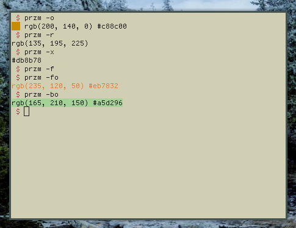

<h1 align="center">przm 🎨</h1>

<p align="center">A simple, yet feature rich color picker and manipulator</center>

<center>
</img>
</center>

**Usage:**

```
Usage: hue [OPTION]
A simple, yet feature rich color picker and manipulator

--help, -h: Display this information
-r: Return the color in the RGB format
-x: Return the color in the hexadecimal format
-o: Don't clean up the output
-f: Color the text foreground
-b: Color the text background

h: Increment the 'R' value
j: Increment the 'G' value
k: Increment the 'B' value
l: Increment all values (brightens the color)
b: Decrement the 'R' value
n: Decrement the 'G' value
m: Decrement the 'B' value
,: Decrement all values (dims the color)
[space]: Sets the color to black
```
